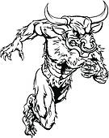
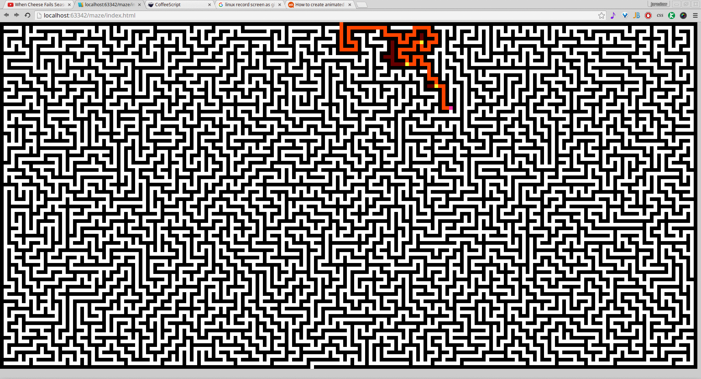

# *A*Maze

* Recursive backtracker (so-called perfect maze creation algorithm) maze generator based on the `window.innerWidth` and `window.innerHeight`.
* Tremaux maze solver.
* All written in CoffeeScript because there is never enough coffee.

# Running

Just open `index.html`.

# Compiling

When in the project root folder type:
`coffee -m -w -c -o lib/ coffee/`

and refresh `index.html` (CTRL+R is good to remove cached content).

# Reference
[Think Labyrinth describing variation of maze solvers and generators](http://www.astrolog.org/labyrnth/algrithm.htm)
